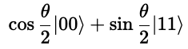

# What is this

Qiskitライブラリを使い、CHSH不等式を量子ゲート回路でシミュレーションするプログラム

# セットアップ

Pythonは、Version 3.6以上が必要です。（私は3.8.12で確認しました）

Qiskitをインストールする必要があります
https://qiskit.org/

```
% pip install 'qiskit[visualization]'
```

# 実行方法

実行するには

```
% python chsh_inequality.py
```

を実行するだけです。θを-π〜+πの範囲で少しずつ変えながら、各θに対して 10000 回シミュレーションを行います。

数値計算結果と、グラフが表示されて終わります。

```
-3.141592653589793 1.4026
-2.9804853380210856 1.6760000000000002
-2.8193780224523786 1.8388
-2.658270706883671 2.0974000000000004
...
2.6582707068836706 0.7478
2.819378022452378 0.9572
2.9804853380210856 1.1806
3.141592653589793 1.4108
```


グラフをみると、θが -7π/8〜-π/8のあたりで2.0を超えていることが分かります。
（古典論ではベルの不等式が成り立つため、それだけ相関が強くても2.0を超えることはあり得ない）

なお、理論値はθが-π/2のときで、そのときの値は2√2です。図では青い線でθ=-π/2のところになります。

# 解説

CHSH不等式のD


を、量子ゲート回路を使ってシミュレーションしてみます。

ここでは簡単のため、2量子ビットの初期状態を、θをパラメータとして、


で作成しました。（この時点でかなり作為的ではありますが、あまりパラメータが多いとプロットできないので、今回はパラメータはθだけにしました）

一番左側の生成された直後のq_0, q_1はそれぞれ |0〉 状態です。これに、適用されている2つの回路は、それぞれ次のようになります。

1つ目の回路は、y軸周りの回転を行うR_y(θ)回路。この回路により


となります。

2つ目の回路は、制御Not回路です。第0ビットが1のときだけ、第1ビットを反転させます。これを適用することにより、



という状態が作成されます。

この2量子ビットの状態について、Aliceは第0ビット、Bobは第1ビットを計測したいのです。

Aliceが計測したいのは、第0ビットのz方向のスピン(σ_z)または、第0ビットのy方向のスピン(σ_y)
のどちらかです。（量子論のため、アリスは、z方向とy方向のスピンを両方を同時には計測出来ません）


Bobが計測したいのは、第1ビットのz'方向のスピン(σ_z')または、第1ビットのy'方向のスピン(σ_y')のどちらかです。z'方向とy'方向は、z方向,y方向と比べて、(x方向に向かって) π/4回転しています。
（量子論のため、Bobもz'方向とy'方向のスピンを両方を同時には計測出来ません）


実際には計測装置を動かすことは出来ないので、代わりに量子ビットの方を回転させることで計測しています。

注意）この座標系のとり方は、入門・現代の量子力学（堀田）のp.10の図17の右上と比べると、左右が逆に見えますが、x軸の向き（つまり前後）も逆になっているため、結局は同じ図になっています。（つまり、どちらも右手系です）

さて、それでは、Dの式の4つの項を計算するために、それぞれ個別に回路を組み立てていきます。

第1項


第2項


第3項


第4項


